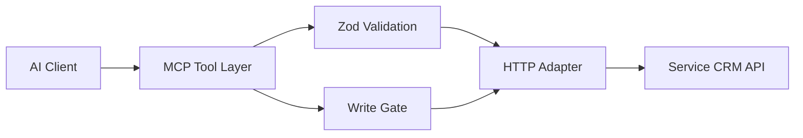

# Titan MCP Server

A Node.js Model Context Protocol (MCP) integration for a service-business CRM API.

This repository demonstrates how I expose an existing operational API as bounded agent tools instead of giving an AI model arbitrary HTTP access.

## What it demonstrates

- MCP server/tool design
- Zod-validated tool inputs
- environment-based credentials
- read/write separation
- optional per-request credential context
- service-business quoting and customer workflow integration
- explicit write gating through configuration

## Architecture



## Configuration

Create a local `.env` file. Do not commit credentials.

```env
PORT=8787
CRM_BASE_URL=https://example.com
SNG_API_KEY=
SNG_ORG_SLUG=
SNG_ALLOW_WRITES=false
SNG_MCP_TOKEN=
```

Writes are disabled unless `SNG_ALLOW_WRITES=true` is explicitly configured.

## Security boundary

**Do not expose this server directly to the public internet as-is.**

The current transport contains a compatibility path where HTTP authentication is disabled because an upstream integration did not preserve the Authorization header. In production, this service must therefore run behind a trusted/private transport or an authenticated reverse proxy unless transport authentication is re-enabled.

That limitation is documented here intentionally: the MCP tool layer protects application actions, but transport security still belongs at the network boundary.

Credentials are read from environment variables; no production credentials should be committed to this repository.

## Run

```bash
npm install
npm start
```

## Why this is public

This is a compact integration example showing MCP, schema validation, API adaptation, and bounded write behavior. Larger commercial systems and client implementations remain private.

## License

No open-source license is granted unless a license file is added later.
